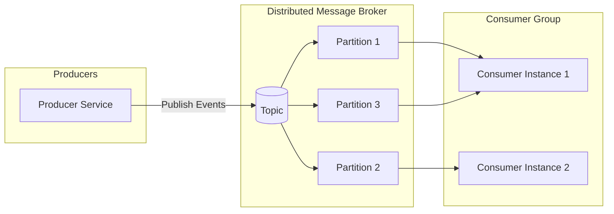

Overview on pubsub vs kafka - 06/05/2026
pub sub is an architecture that aims to solve synchronous message passing problem. The receiver asks for a service from the sender and the sender serves a request and waits for requester acknowledgement. If the sender is waiting for acknowledgement then the sender is blocked from serving others.

The Pub/Sub model is a messaging pattern where a message broker routes messages from publishers to subscribers based on subscriptions, ensuring scalable and reliable delivery.

