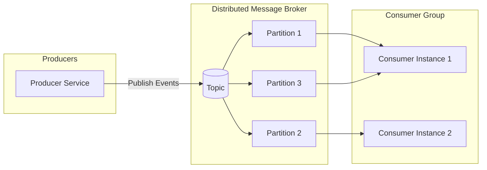

#### Overview on Google Cloud pubsub vs kafka - 06/05/2026
pub sub is an architecture that aims to solve synchronous message passing problem. The receiver asks for a service from the sender and the sender serves a request and waits for requester acknowledgement. If the sender is waiting for acknowledgement then the sender is blocked from serving others.

The Pub/Sub model is a messaging pattern where a message broker routes messages from publishers to subscribers based on subscriptions, ensuring scalable and reliable delivery.

Main components:
Publisher: Creates and sends messages to topics without knowing subscribers.
Subscriber: Receives messages from subscribed topics without knowing publishers.
Topic: A named channel that categorizes messages. Publishers send messages to topics, and subscribers subscribe to them.
Message Broker: Routes messages from publishers to subscribers based on subscriptions. Features like delivery guarantees, persistence, and scalability depend on the specific system and configuration (e.g., Kafka, RabbitMQ).
Message: The data unit exchanged, which can be text, JSON, or binary.
Subscription: Links subscribers to topics, defining which messages are received and delivery guarantees (e.g., at-most-once, at-least-once).

Working
Explain how the Pub/Sub architecture works:

Step 1: Publishers create messages and send them to the Pub/Sub system. They sort these messages into topics or channels based on what the messages are about.
Step 2: Subscribers let the system know which topics they're interested in. They’ll get messages only from those topics.
Step 3: Topics are basically channels for messages. Publishers send their messages to specific topics, and subscribers can choose one or more topics to follow.
Step 4: Message brokers act as go-betweens, managing how messages get from publishers to subscribers. They take messages from publishers and send them to the subscribers who are interested.
Step 5: When a publisher sends a message to a topic, the message broker grabs it and sends it out to all the subscribers who have signed up for that topic.
Step 6: The Pub/Sub system allows for asynchronous communication. This means publishers can send messages without waiting for subscribers to be ready, and subscribers can pick up messages whenever it suits them, without needing the publisher to be around.

Use Cases for architecture:
- Scenarios where asynchronous and scalable communication between components is required.
- Real Time data streaming.
- Event Driven architectures.
- Message Queues.
- Notifications and Alerts.
- Scalable Web Apps.
- Microservices Communication.

Comparing Pub/Sub to other Messaging Technologies
The comparison of Pub/Sub to other messaging Technologies is:

Pub/Sub Vs Message Queues: Message Queues deliver messages to one consumer at a time (point-to-point), ensuring order and delivery. Pub/Sub broadcasts messages to multiple subscribers simultaneously, ideal for event-driven systems.
Pub/Sub Vs Streaming Platforms: Streaming platforms (e.g., Kafka) handle continuous data streams with long-term retention and complex processing. Pub/Sub focuses on simpler, real-time message delivery.
Pub/Sub Vs WebSockets: WebSockets enable real-time, bidirectional client-server communication (e.g., chat). Pub/Sub decouples publishers and subscribers, supporting multiple subscribers without direct connections.
Pub/Sub Vs HTTP APIs: HTTP APIs use synchronous request-response communication. Pub/Sub supports asynchronous messaging, allowing publishers to send without waiting for subscriber responses.

When to Use
Use Pub/Sub Architecture when:

Subscribers don’t need to know about each other, making the system more flexible and easier to scale.
Pub/Sub helps you build systems that can grow easily. You can add more publishers or subscribers without disrupting the existing setup.
If you want parts of your system to communicate without waiting for each other, Pub/Sub is a great option. Publishers can send messages without needing to wait for subscribers.
This approach is perfect for event-driven systems. Publishers can send out events, and subscribers can respond to those events without being tightly linked together.
With Pub/Sub, subscribers can change their interests at runtime. They can subscribe to different topics or types of messages, adding more flexibility to the system.

#### DO NOT USE PUB/SUB IF:
- very quick communication is necessary. the process of routing messages and managing subscriptions can slow things down.
- pub/sub can make your system more complicated, especially when routing messages and handling subscriptions.
- communication requires sequencing as ordering is not guaranteed in pub/sub
- smaller applications with few components. pub/sub adds unnecessary complexity.

#### BENEFITS
- Scalability ( easily scales with decoupled components)
- Decoupling pubs and subs operate independently simplifying system design and maintenance.
- Asynchronous Communication
- Reliability ( acknowledgements, retries and fault-handling mechanisms)

#### CHALLENGES
- Message Ordering
- Exactly-once Delivery
- Latency
- Complexity

#### KAFKA

Kafka is a distributed event store and stream-processing platform. Open-source system. 

Rule of Thumb:
- Choose Kafka i fyou need real-time streaming, replay, rich integrations and cross-cloud flexibility.
- Choose Pub/Sub if you want simple, reliable, cloud-native messaging inside Google Cloud with zero management

#### COMPARISONS OF USE CASES - SPOTIFY USE CASE (EVENT DELIVERY)

## Choice of reliable and persistent queue
| Kafka | Pub/Sub |
|-------|---------|
| Real-time Analysis  | Event delivery System|
| Data Replay | Highly Structured Format taking load off ETL process|
| Production traffic caused issues | Global availabiity using underlying Google network|
| Issue with Kafka Mirror Maker being confused on consumnption leader and mirroring between data centers would stop | |
| restart service on breakdown | Simple REST API providing access own custom client library |
| Operational responsibility needs to be managed| Operational responsibility was handled by someone else—there was no need to create a capacity model or deployment strategy, or to set up monitoring and alerting.|

##  Decision - Google Pub/Sub
- Latency was low and consistent
- capacity limitation was the one explicitly set by the available quota.

